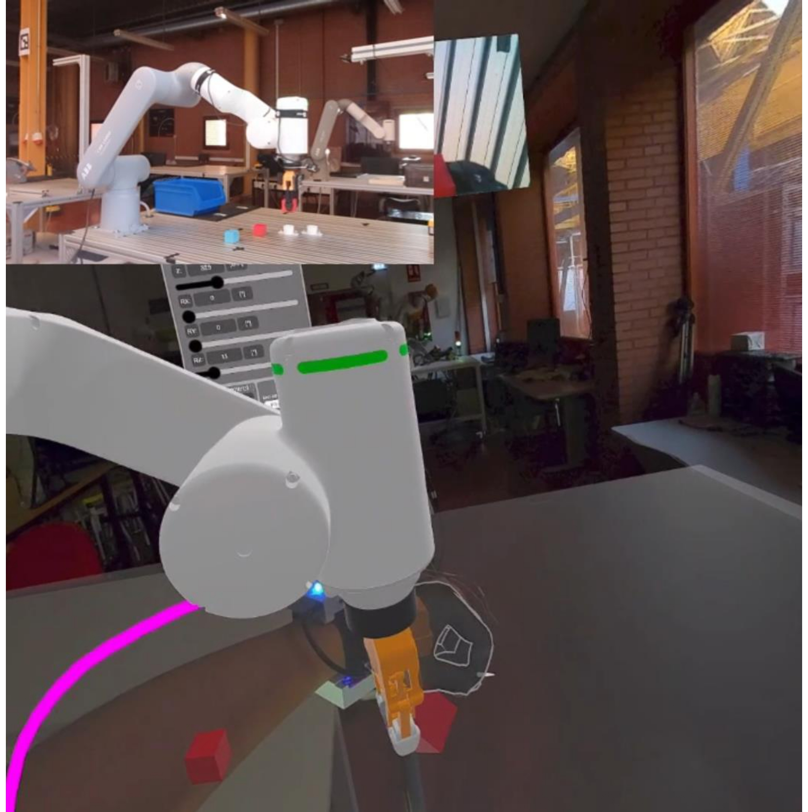
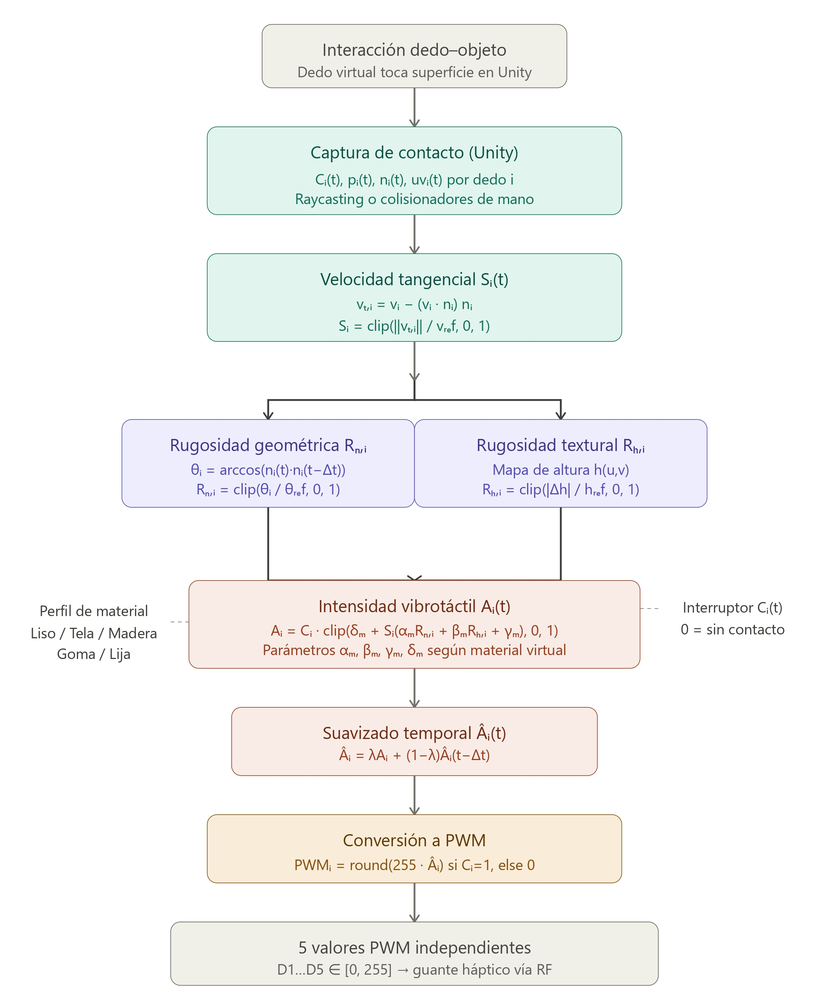
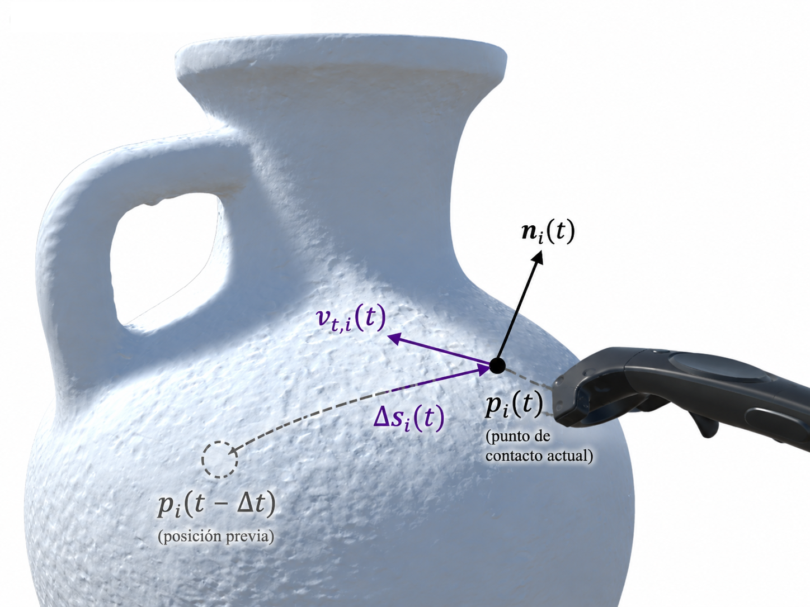
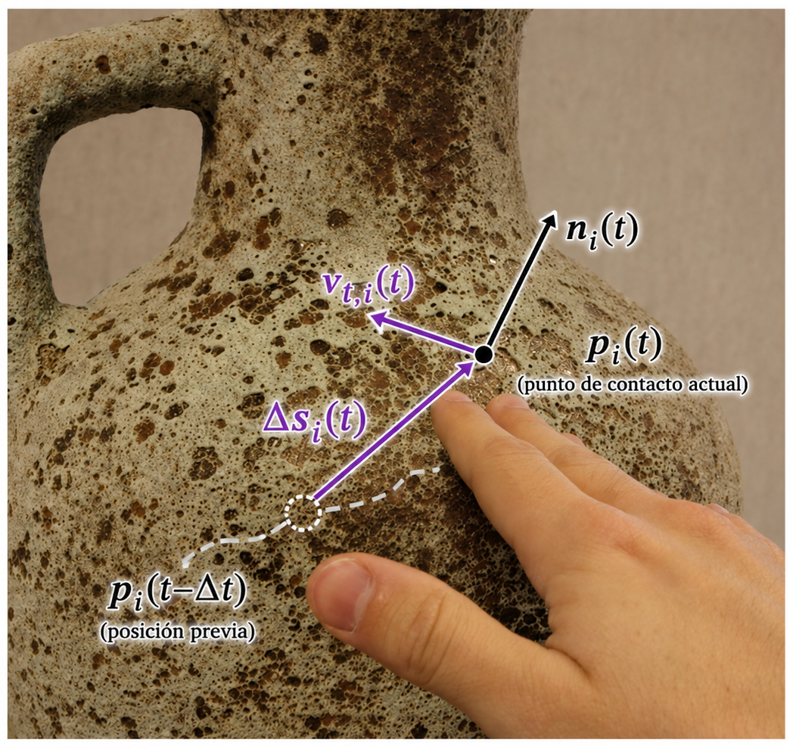
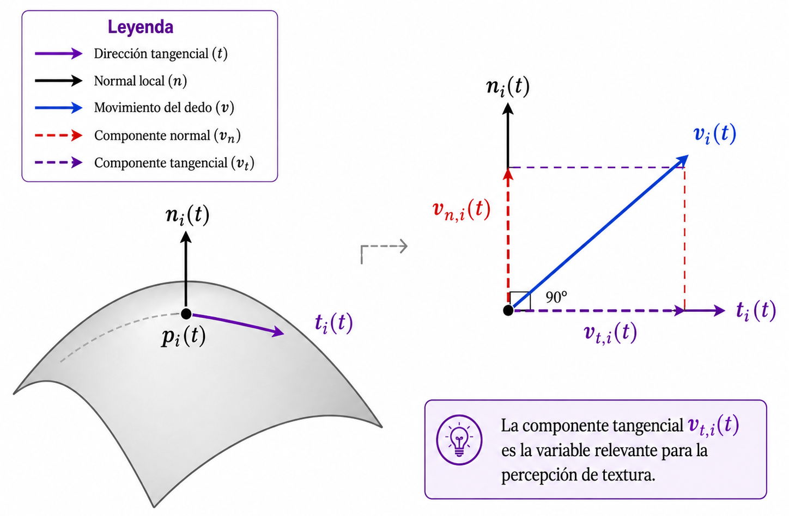
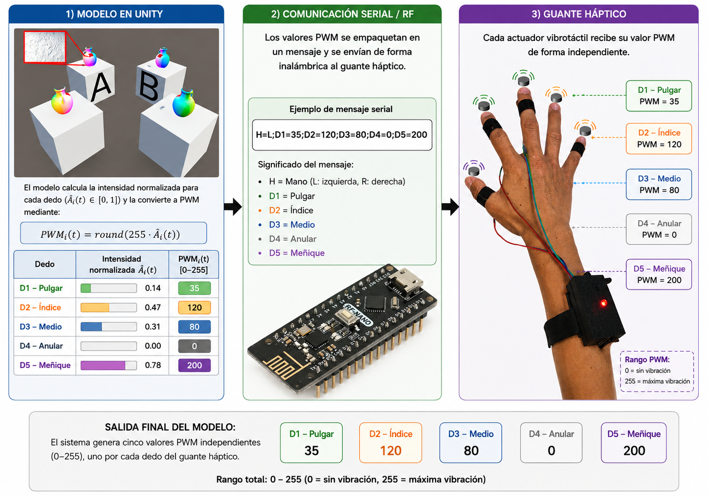

# VR-Vibrotactile-Haptics_Gloves

Unity-based vibrotactile texture rendering system for portable haptic gloves, designed to enhance immersive robotic teleoperation through independent finger-level tactile feedback.

This project extends the original **VR-Vibrotactile-Haptics** repository by adapting the concept of vibrotactile roughness rendering from VR controllers to a wearable haptic glove based on vibrating thimbles. Instead of using the vibration motors of commercial VR controllers, this version aims to generate independent PWM values for each finger, allowing a vibrotactile glove to reproduce different virtual texture sensations during object manipulation.

The system is intended for immersive robotic teleoperation scenarios, where the user interacts with virtual or remote objects and receives tactile information about contact, roughness, smoothness, and surface relief.



---

## Project Overview

The main goal of this repository is to implement a vibrotactile texture rendering model in Unity for integration with a portable haptic glove.

Unlike simple binary haptic feedback, which only indicates whether contact has occurred, the proposed approach generates variable vibrotactile feedback according to:

- finger-object contact detection,
- tangential finger motion over the surface,
- surface normal variation,
- virtual material height map variation,
- material-dependent haptic parameters.

The final output of the model is a set of independent PWM values, one for each finger, within the range:

```text
D1, D2, D3, D4, D5 ∈ [0, 255]
```

These values can be sent to a microcontroller or wireless RF module connected to a vibrotactile haptic glove.

---

## Conceptual Model

The vibrotactile rendering model follows a finger-object interaction pipeline implemented in Unity.

First, Unity detects the contact between each virtual finger and the object surface. Then, the system captures the contact point, surface normal, texture coordinates, and finger motion. Based on this information, the model estimates the perceived texture intensity and converts it into PWM values for the glove actuators.



The model considers each finger independently. For each finger `i`, the following variables are used:

```text
Cᵢ(t)   → contact state
pᵢ(t)   → contact point
nᵢ(t)   → surface normal
uvᵢ(t)  → texture coordinates
vₜ,ᵢ(t) → tangential velocity
PWMᵢ(t) → output vibration value
```

The contact state is used as an activation condition. If the finger is not touching the object, the PWM output is set to zero. If contact exists, the vibration intensity is computed according to the motion and texture properties.

---

## Finger-Surface Interaction

The system estimates the interaction between the virtual finger and the object surface using contact detection methods such as raycasting or hand collider-based detection.

The contact point and local surface normal are used to determine how the finger moves over the object. This is important because texture perception is not only related to touching a surface, but also to sliding the finger across it.



The real tactile exploration figure represents the physical reference behind the proposed model. In real interaction, texture perception is not produced only by touching an object, but also by sliding the finger over its surface. This real contact situation helps explain why the proposed Unity model considers the previous position, current position, and movement direction when generating vibrotactile feedback.



The finger movement is decomposed into normal and tangential components. The tangential component is especially relevant for texture rendering, since sliding over rough or irregular surfaces produces stronger tactile sensations.



---

## Vibrotactile Texture Rendering

The model estimates texture intensity from two main sources:

### 1. Geometric Roughness

Geometric roughness is obtained from the variation of surface normals between consecutive contact points. Smooth surfaces produce small normal variations, while rough or irregular surfaces produce larger changes.

### 2. Height Map Variation

The texture map or height map of the virtual material is also used to estimate local surface variation. When the finger moves across the object, changes in the height map are interpreted as additional texture information.

The resulting vibrotactile intensity is calculated as a normalized value between 0 and 1. This value is then smoothed over time and converted into a PWM signal.

```text
PWMᵢ(t) = round(255 · Âᵢ(t))
```

where:

```text
Âᵢ(t)   → smoothed vibrotactile intensity for finger i
PWMᵢ(t) → final PWM value sent to the actuator
```

---

## Material Profiles

Different virtual materials can be represented using different haptic parameters. Each material profile modifies the contribution of geometric roughness, texture map variation, sliding motion, and base vibration.

Example material profiles:

| Virtual Material | Expected Vibrotactile Response |
|---|---|
| Smooth | Minimal and soft vibration |
| Fabric | Light and continuous variation |
| Wood | Medium roughness with directional perception |
| Rubber | Drag-dependent sensation |
| Sandpaper | High and clear roughness |

These profiles can be adjusted experimentally according to the vibration motors, the glove design, and user perception.

---

## Haptic Glove Architecture

The proposed architecture is organized into three main stages:

1. **Unity model**  
   Computes the vibrotactile intensity for each finger based on contact, motion, and texture information.

2. **Serial / RF communication**  
   Sends the generated PWM values from the computer to the haptic glove communication module.

3. **Haptic glove**  
   Receives the PWM values and applies independent vibration intensity to each finger actuator.



An example communication frame is:

```text
H=L;D1=35;D2=120;D3=80;D4=0;D5=0
```

where:

```text
H=L   → left hand
D1    → thumb actuator PWM
D2    → index finger actuator PWM
D3    → middle finger actuator PWM
D4    → ring finger actuator PWM
D5    → little finger actuator PWM
```

This structure allows each finger to receive a different vibration intensity according to the simulated texture and the user’s movement.

---

## Prerequisites

To use or modify this project, the following elements are recommended:

1. Unity Engine.
2. A VR headset compatible with the original project setup.
3. SteamVR or the corresponding VR input configuration.
4. A virtual hand or stylus interaction system.
5. A vibrotactile haptic glove with independent actuators.
6. A microcontroller or wireless communication module capable of receiving PWM values.
7. Serial or RF communication between Unity and the glove hardware.

---

## How to Use

1. Open the project in Unity.
2. Load the main scene included in the project.
3. Verify that the VR headset and controller bindings are correctly configured.
4. Attach the texture rendering scripts to the corresponding Manager object or interaction controller.
5. Assign the virtual objects with mesh colliders and material properties.
6. Configure the haptic material parameters.
7. Run the scene and interact with the virtual objects.
8. Send the generated PWM values to the haptic glove through the selected communication interface.

---

## How to Modify the Haptic Response

The vibrotactile response can be modified by adjusting the parameters associated with each virtual material.

The most relevant parameters are:

1. **Geometric roughness weight**  
   Controls how much the variation of surface normals affects the vibration.

2. **Height map weight**  
   Controls how much the texture or height map variation affects the vibration.

3. **Sliding contribution**  
   Controls the vibration component associated with tangential finger movement.

4. **Base vibration**  
   Defines a minimum vibration level when contact exists.

5. **Smoothing factor**  
   Controls how fast or gradual the vibration changes over time.

6. **PWM limits**  
   Allows the maximum vibration intensity to be limited for comfort or actuator protection.

---

## Relation to the Original Repository

This repository is based on the original project:

**VR-Vibrotactile-Haptics**  
Original repository:  
https://github.com/IvanNik17/VR-Vibrotactile-Haptics

The original project was designed to test the use of vibrotactile motors in HTC Vive controllers to reproduce surface roughness sensations for in-air haptics. It was based on the paper:

**Preliminary Study on the Use of Off-the-Shelf VR Controllers for Vibrotactile Differentiation of Levels of Roughness on Meshes**  
VISIGRAPP 2020  
https://www.scitepress.org/Link.aspx?doi=10.5220%2f0009101303340340

This adapted version keeps the general idea of vibrotactile texture differentiation but redirects the output toward a portable haptic glove with independent finger-level PWM control.

---

## Research Context

This repository is related to the development of vibrotactile feedback systems for immersive robotic teleoperation. The approach aims to improve the operator’s tactile perception during remote manipulation by providing additional information about contact and virtual surface properties.

The system is especially oriented toward applications such as:

- immersive robotic teleoperation,
- virtual object manipulation,
- haptic interaction in VR,
- texture rendering,
- robotic training environments,
- serious games,
- motor rehabilitation scenarios.

---

## Citation

If you use this repository or the concepts developed in this work, please cite the related research work:

```bibtex
@inproceedings{yepezfigueroa2026vibrotactile,
  title        = {Vibrotactile rendering of virtual textures in Unity for immersive teleoperation},
  author       = {Yepez-Figueroa, Johnny J. and O{\~n}a, Edwin D. and Balaguer, Carlos and Jard{\'o}n, Alberto},
  booktitle    = {Jornadas de Autom{\'a}tica},
  volume       = {47},
  year         = {2026}
}
```

The original reference work should also be cited when using the roughness rendering approach based on VR controller vibration:

```bibtex
@inproceedings{nikolov2020preliminary,
  title     = {Preliminary Study on the Use of Off-the-Shelf VR Controllers for Vibrotactile Differentiation of Levels of Roughness on Meshes},
  author    = {Nikolov, Ivan and H{\o}ngaard, Jens Stokholm and Kraus, Martin and Madsen, Claus B.},
  booktitle = {Proceedings of the 15th International Joint Conference on Computer Vision, Imaging and Computer Graphics Theory and Applications},
  pages     = {334--340},
  year      = {2020},
  publisher = {SciTePress},
  doi       = {10.5220/0009101303340340}
}
```

---

## Acknowledgements

This project is based on the original VR-Vibrotactile-Haptics repository and the research work by Nikolov et al. on vibrotactile roughness differentiation using commercial VR controllers.

This adapted version is focused on the integration of vibrotactile texture rendering with a portable haptic glove for immersive robotic teleoperation.

---

## License

This repository keeps the license terms of the original project. Please review the `LICENSE` file before using, modifying, or redistributing the code.